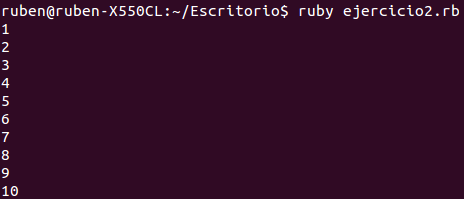
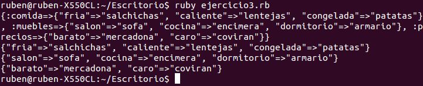

<h1>EJERCICIOS SEMINARIO 1</h1>
<h2>Rubén Jiménez Ortega</h2>

###1. Instalar Ruby y usar `ruby --version` para comprobar la versión instalada. A la vez, conviene instalar también `irb`, `rubygems` y `rdoc`.

Instalo __ruby__ con el siguiente comando:

    sudo apt-get install ruby-full

Y compruebo la versión:

Instalo __irb__ con el siguiente comando:

    sudo apt-get install irb

Y compruebo la versión:

Instalo __rubygems__ con el siguiente comando:

    sudo apt-get install rubygems

Y compruebo la versión:

Instalo __rdoc__ con el siguiente comando:

    sudo gem install rdoc-data
    sudo rdoc-data --install

Y compruebo la versión:

###2. Crear un programa en Ruby que imprima los números desde el 1 hasta otro contenido en una variable.

El contenido de _ejercicio2.rb_ es:

    #!/usr/bin/ruby
    # encoding: ISO-8859-1

    $i = 1
    $num = 10

    until $i > $num  do
       puts($i)
       $i +=1;
    end

Su salida es la siguiente:

###3. ¿Se pueden crear estructuras de datos mixtas en Ruby? Crear un array de hashes de arrays e imprimirlo.

Ruby permite crear estructuras de datos de tipo Array y de tipo Hash. Un array tiene como índice un entero mientras que un hash tiene como índice una cadena de texto.

Un ejemplo de array y como se recorre con un iterador:

    comida = ['pasta', 'pan', 'salchichas']
    comida.each do |c|
      puts "#{c}"
    end

Ahora un ejemplo de hash y como se recorre con un iterador:

    comida = {
        :pasta => 'tarro',
        :pan => 'panera,'
        :salchichas => 'frigorifico'
    }
    comida.each_with_index do |c,i|
        puts "indice: #{i} contenido:#{c}"
    end

También es posible recorrer un array pasando por todos los indices numéricos con un for:

    comida = ['pasta', 'pan', 'salchichas']
    for i in 0..comida.length
            puts comida[i]
    end

Sí se pueden crear estructuras mixtas en Ruby, además fácilmente. Un programa de ejemplo con array de hashes de arrays podría ser el siguiente:

    #!/usr/bin/ruby

    prueba = { :comida => {"fria" => 'salchichas', "caliente" => 'lentejas', "congelada" => 'patatas'}, :muebles => {"salon" => 'sofa', "cocina" => 'encimera', "dormitorio" => 'armario'}, :precios => {"barato" => "mercadona", "caro" => "coviran"}}

    puts prueba.inspect

    prueba.keys().each do |valor|
        puts prueba[valor]
    end

###4. Crear una serie de funciones instanciadas con un URL que devuelvan algún tipo de información sobre el mismo: fecha de última modificación, por ejemplo. Pista: esa información está en la cabecera HTTP que devuelve.

Vamos a ver cuando fue la última modificación del logo de [IANA](http://www.iana.org/_img/2013.1/iana-logo-header.svg), gracias a este script:

    #!/usr/bin/ruby
    # encoding: ISO-8859-1

    require 'open-uri'

    last_modified = open('http://www.iana.org/_img/2013.1/iana-logo-header.svg') do |f|
    f.last_modified
    end

    puts last_modified

###5. Ver si está disponible Vagrant como una gema de Ruby e instalarla.

He encontrado el [siguiente](https://github.com/rails/rails-dev-box).

La instalación es la que sigue:

  - Es necesario tener instalado Vagrant y VirtualBox, en caso negativo:

        sudo apt-get install virtualbox
        sudo apt-get install vagrant

  - Una vez que tenemos esto, descargamos el vagrant y accedemos al directorio:

        git clone https://github.com/rails/rails-dev-box.git
        cd rails-dev-box

   - Lanzamos la máquina virtual:

          vagrant up

   - Después de que la instalación haya terminado, nosotros ya podemos tener acceso a nuestra máquina virtual con:

          vagrant ssh

   - Comprobamos que efectivamente tiene Ruby:

          ruby --version

  
