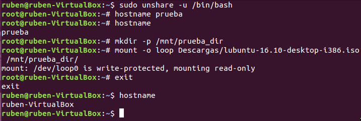
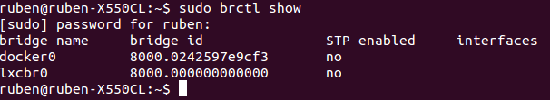
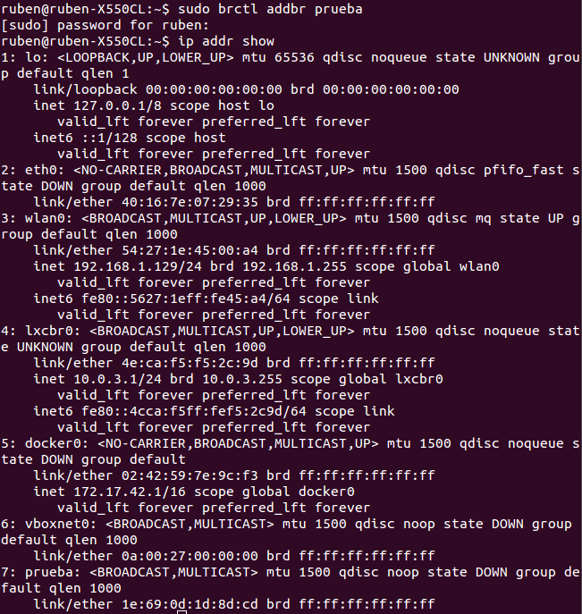
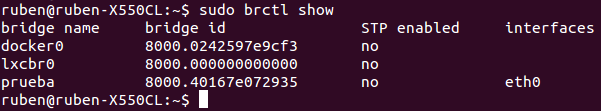
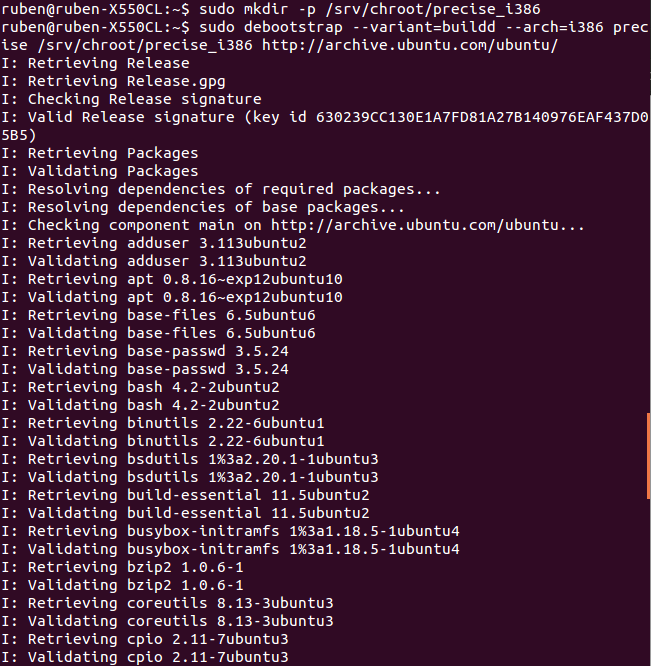
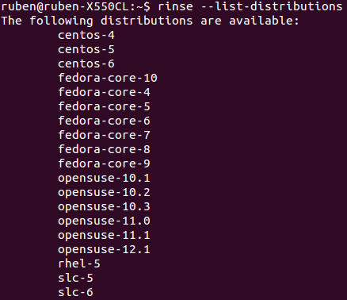
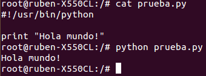
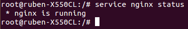
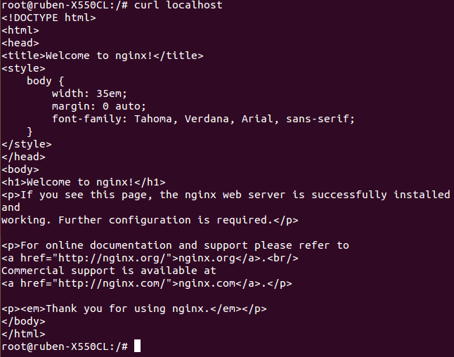
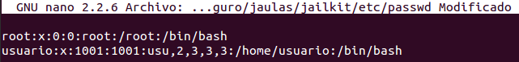

<h1>EJERCICIOS TEMA ADICIONAL 1 (Técnicas de virtualización)</h1>
<h2>Rubén Jiménez Ortega</h2>

###1. Crear un espacio de nombres y montar en él una imagen ISO de un CD de forma que no se pueda leer más que desde él. Pista: en ServerFault nos explican como hacerlo, usando el dispositivo loopback.

1. Creamos el espacio de nombres en que vamos a montar la imagen ISO:

        sudo unshare -u /bin/bash

2. Cambiamos el nombre del sistema:

        hostname prueba

3. Comprobamos que se ha cambiado con:

        hostname

4. Creamos el directorio donde vamos a montar la imagen:

        mkdir -p prueba_dir

5. Montamos la imagen:

        mount -o loop Imagen.iso prueba_dir

6.  Salimos y comprobamos el nombre del sistema para comprobar que estamos fuera del espacio.

###2.
####2.1 Mostrar los puentes configurados en el sistema operativo.

Usamos:

    sudo brctl show

####2.2 Crear un interfaz virtual y asignarlo al interfaz de la tarjeta wifi, si se tiene, o del fijo, si no se tiene.

Creamos la interfaz virtual y comprobamos que se ha creado:

Asignamos esa interfaz a _eth0_:

    sudo brctl addif prueba eth0

Comprobamos que la interfaz "prueba" esta asignada a _eth0_:

###3.
####3.1 Usar debootstrap (o herramienta similar en otra distro) para crear un sistema mínimo que se pueda ejecutar más adelante.

Vamos a crear con `debootstrap` un sistema basado en la última versión estable de Ubuntu. Primero creamos un directorio:

####3.2 Experimentar con la creación de un sistema Fedora dentro de Debian usando Rinse.

Para conocer los distintos sistemas que podemos instalar con rinse:

    --list-distributions

Vamos a instalar la última versión que hay disponible de Fedora(Fedora 10):

    sudo rinse --arch=amd64 --distribution fedora-core-10 --directory /home/jaulas/fedora

###4. Instalar alguna sistema debianita y configurarlo para su uso. Trabajando desde terminal, probar a ejecutar alguna aplicación o instalar las herramientas necesarias para compilar una y ejecutarla.

Usaré ubuntu del apartado anterior. Para acceder a dicha jaula usaré:

    chroot /home/jaulas/saucy/

Montamos el filesystem virtual `/proc`:

    mount -t proc proc /proc

Creamos un script en python y lo ejecutamos, para ello, instalamos:

    apt-get install python

El script que usaré es:

    #!/usr/bin/python
    print "Hola mundo!"

Y su ejecución es la siguiente:

###5. Instalar una jaula chroot para ejecutar el servidor web de altas prestaciones nginx.

Instalamos curl:

    apt-get install curl

Instalamos nginx:

    wget http://nginx.org/keys/nginx_signing.key)
    echo "deb http://nginx.org/packages/ubuntu/ raring nginx" >> /etc/apt/sources.list
    echo "deb-src http://nginx.org/packages/ubuntu/ raring nginx" >> /etc/apt/sources.list
    apt-get update
    apt-get install nginx

Comprobamos que nginx esta funcionando:

  

Comprobamos que está funcionando con el navegador:

  

###6. Crear una jaula y enjaular un usuario usando `jailkit`, que previamente se habrá tenido que instalar.

Los siguientes comandos se usan desde la terminal exterior a la jaula.

Instalación de jailkit:

    wget http://olivier.sessink.nl/jailkit/jailkit-2.16.tar.gz
    tar -xzvf jailkit-2.16.tar.gz
    cd jailkit-2.16
    ./configure && make && sudo make install

Ahora necesitamos crear un sistema de ficheros perteneciente al usuario "root" que será sobre el que realizaremos la jaula con jailkit.

    mkdir -p /seguro/jaulas/jailkit
    chown -R root:root /seguro

Creamos nuestra jaula, herramientas de red y un editor de texto:

    jk_init -v -j /seguro/jaulas/jailkit jk_lsh basicshell netutils editors

Vamos a enjaular a un usuario, para ello tenemos que crear un usuario (adduser usuario) y lo enjaulamos con:

    sudo jk_jailuser -m -j /seguro/jaulas/jailkit usuario

Para poder conectarnos con el shell de la jaula tendremos que acceder al archivo "/seguro/jaulas/jailkit/etc/passwd" y cambiar en la línea correspondiente al usuario que hemos enjaulado el shell que usa, pasando de "jk_lsh" a "bash":

    
