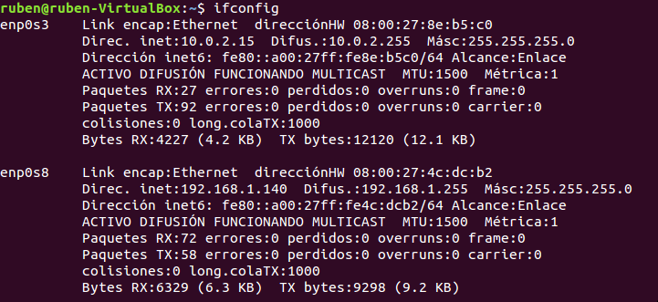
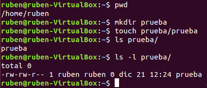
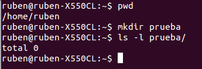
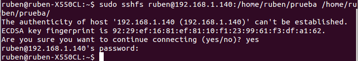
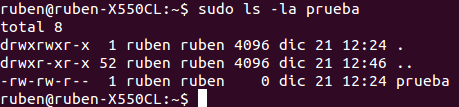

<h1>EJERCICIOS TEMA ADICIONAL 2 (Virtualización del almacenamiento)</h1>
<h2>Rubén Jiménez Ortega</h2>

###1. ¿Cómo tienes instalado tu disco duro? ¿Usas particiones? ¿Volúmenes lógicos?

En mi disco duro tengo instalado Windows 10 y Ubuntu 14.04.5 LTS, para ello tengo el espacio en el disco duro particionado en 2 particiones primarias y una extendida con 3 volúmenes lógicos en su interior.

###2. Usar FUSE para acceder a recursos remotos como si fueran ficheros locales. Por ejemplo, sshfs para acceder a ficheros de una máquina virtual invitada o de la invitada al anfitrión. Avanzado Usar los drivers de FUSE para Ruby (aquí explican más o menos como hacerlo con fusefs para mostrar el contenido de una estructura de datos en un lenguaje como si fuera un fichero. Este es un ejemplo en Python.

Instalamos `sshfs` en la máquina anfitriona y en la remota:

    sudo apt-get install sshfs

En la máquina virtual, tenemos que añadir al grupo `fuse` el usuario con el que nos conectaremos remotamente a la máquina virtual:

    sudo usermod -a -G fuse ruben

Vemos la IP que tiene la máquina virtual:

Vamos a crear en la máquina virtual un directorio llamado `prueba` en el directorio home del usuario ruben, y dentro crearemos un archivo vacío llamado prueba:

En el anfitrión también crearemos un directorio el cual después lo montaremos:

Y ya solo nos queda conectarnos indicando el nombre del usuario remoto, la dirección IP de la máquina remota, la ruta del recurso remoto y la ruta del recurso local en el que montamos dicho recurso remoto:

    sshfs ruben@192.168.1.140:/home/ruben/prueba /home/ruben/prueba

Comprobamos el contenido de el directorio `prueba/` en local, y vemos que contiene el archivo prueba:

###3. Crear imágenes con estos formatos (y otros que se encuentren tales como VMDK) y manipularlas a base de montarlas o con cualquier otra utilidad que se encuentre.

Vamos a probar los diferentes tipos de imágenes que soporta QEMU,  por ejemplo:

- raw: `qemu-img create -f raw imagen-raw.img 100M`
- qcow2: `qemu-img create -f qcow2 imagen-qcow2.qcow2 100M`
- vmdk: `qemu-img create -f vmdk imagen-vmdk.vmdk 100M`
- vdi: `qemu-img create -f vdi imagen-vdi.vdi 100M`

Esto crea imágenes en blanco, vamos a montarlas ahora como un dispositivo loop:

    sudo mount -o loop,offset=32256 imagen-raw.img /mnt/monta

###5. Instalar ceph en tu sistema operativo.

Usamos el comando:

    sudo apt-get install ceph-mds

###7. Almacenar objetos y ver la forma de almacenar directorios completos usando ceph y rados.

Creamos una "piscina":

    rados mkpool prueba-piscina

Comprobamos que se ha creado:

    rados lspools

Podemos ver su contenido:

    rados df

Introducimos algo en la piscina:

    rados put -p prueba-piscina objeto hola.img

Listamos el contenido de la piscina:

    rados ls -p prueba-piscina
