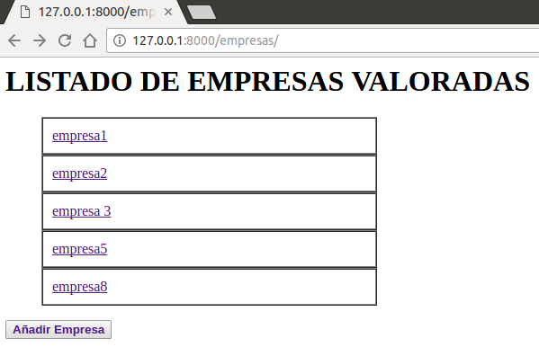

<h1>EJERCICIOS TEMA 2</h1>
<h2>Ruben Jimenez Ortega</h2>

###1. Instalar alguno de los entornos virtuales de node.js (o de cualquier otro lenguaje con el que se esté familiarizado) y, con ellos, instalar la última versión existente, la versión minor más actual de la 4.x y lo mismo para la 0.11 o alguna impar (de desarrollo).

Instalo el entorno virtual de desarrollo __nvm__:

Además instalo varias versiones de __nvm__:

###2. Como ejercicio, algo ligeramente diferente: una web para calificar las empresas en las que hacen prácticas los alumnos. Las acciones serían Crear empresa, Listar calificaciones para cada empresa, crear calificación y añadirla (comprobando que la persona no la haya añadido ya), borrar calificación (si se arrepiente o te denuncia la empresa o algo), Hacer un ránking de empresas por calificación, por ejemplo. Crear un repositorio en GitHub para la librería y crear un pequeño programa que use algunas de sus funcionalidades. Si se quiere hacer con cualquier otra aplicación, también es válido. Se trata de hacer una aplicación simple que se pueda hacer rápidamente con un generador de aplicaciones como los que incluyen diferentes marcos MVC. Si cuesta mucho trabajo, simplemente prepara una aplicación que puedas usar más adelante en el resto de los ejercicios.

He usado varios [tutoriales](http://codehero.co/nodejs-y-express-instalacion-e-iniciacion/). El repositorio de la aplicación se encuentra [aquí](https://github.com/rubenjo7/empresas_IV):

###3. Ejecutar el programa en diferentes versiones del lenguaje. ¿Funciona en todas ellas?

Probamos a usar las distintas versiones, y vemos que si, que funciona todo correctamente con cada una de ellas.

###4. Crear una descripción del módulo usando package.json. En caso de que se trate de otro lenguaje, usar el método correspondiente.

Con python y trabajando en Django, la herramienta equivalente es pip (PyPI) y los archivos de configuración setup.py. Tendría un aspecto tal que así: ''python from setuptools import setup". Este archivo aparece dentro del directorio de la aplicación:

Además creo el archivo requirements.txt que contiene lo necesario para que esto funcione correctamente, para ello uso:

    pip list

Y el contenido de este archivo es:

    Django==1.10.2
    argparse==1.2.1
    wsgiref==0.1.2
    pip==(1.5.4)
    setuptools==(2.2)

Este archivo puede verse [aquí](https://github.com/rubenjo7/empresas_IV/blob/master/requirements.txt).

###5. Automatizar con grunt y docco (o algún otro sistema) la generación de documentación de la librería que se cree. Previamente, por supuesto, habrá que documentar tal librería.

Para documentar la aplicación python, he utilizado epidoc.

    sudo apt-get install python-epydoc

Generar html de modelos y vistas: la opcion -v

    epydoc –html -v models.py views.py

He tenido que comentar previamente las funciones, y el resultado queda así:

###6. Para la aplicación que se está haciendo, escribir una serie de aserciones y probar que efectivamente no fallan. Añadir tests para una nueva funcionalidad, probar que falla y escribir el código para que no lo haga (vamos, lo que viene siendo TDD).

Creación de una nueva empresa:

Vemos que lo pasa perfectamente.

###7. Convertir los tests unitarios anteriores con assert a programas de test y ejecutarlos desde mocha, usando descripciones del test y del grupo de test de forma correcta. Si hasta ahora no has subido el código que has venido realizando a GitHub, es el momento de hacerlo, porque lo vas a necesitar un poco más adelante.

Al trabajar con Django como framework esta tarea ya esta automatizada, ya que todos los test se crean en un archivo llamado test.py que es generado automáticamente a la hora de inicializar el proyecto. Estos test see lanzan mediante:

    python manage.py test empresas

###8. Haced los dos primeros pasos antes de pasar al tercero.

El contenido de mi fichero .travis.yml es:

    language: python
    python:
    - "2.7"
    # does not have headers provided, please ask https://launchpad.net/~pypy/+archive/ppa
    # maintainers to fix their pypy-dev package.
    - "pypy"
    # command to install dependencies install:
    - sudo apt-get install python-dev
    - pip install --upgrade pip
    - pip install Django
    # command to run tests script:
    - python manage.py test

Los resultados son los siguientes:

