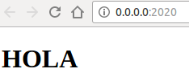
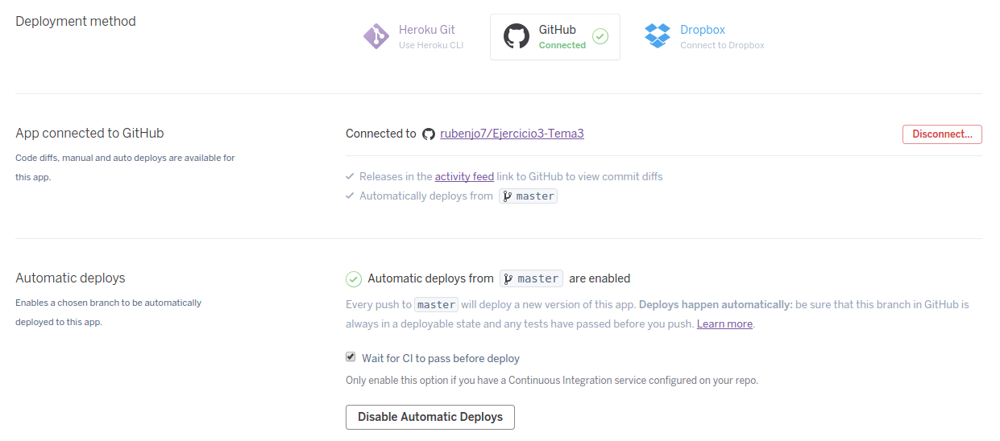
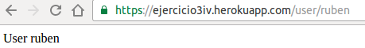

<h1>EJERCICIOS TEMA 3</h1>
<h2>Rubén Jiménez Ortega</h2>

###1. Darse de alta en algún servicio PaaS tal como Heroku, Nodejitsu, BlueMix u OpenShift.

__Heroku__:

1. Rellenar el formulario de registro:

2. Confirmamos el registro mediante un enlace enviado a nuestro correo:

3. Una vez confirmado el correo vemos lo siguiente:

4. Finalmente, podemos acceder a la interfaz de Heroku :

__OpenShitf__:

1. Nos logueamos con nuestra cuenta de Github:

2. Autorizamos la aplicación:

3. Insertamos los datos necesarios:

4. Ya estamos preparados para empezar:

###2. Crear una aplicación en OpenShift o en algún otro PaaS en el que se haya dado uno de alta. Realizar un despliegue de prueba usando alguno de los ejemplos.

1. Creamos la aplicación:

2. Ponemos el nombre que queramos:

3. En la interfaz de OpenShift, buscamos el apartado Instant App y seleccionamos cualquiera, en mi caso yo elegiré la primera opción como prueba:

4. Ponemos los requisitos que nos piden a nuestro gusto:

5. Vemos que ya esta creada nuestra aplicación:

6. Y listo, ya podemos empezar a personalizar la aplicación:

###3. Realizar una app en express (o el lenguaje y marco elegido) que incluya variables como en el caso anterior.

He elegido python y Flask. La aplicación muestra un mensaje de bienvenida en el menú inicial. Si accedemos a la ruta, por ejemplo, /user/ruben mostrará un mensaje diciendo: "user ruben"

    from flask import Flask, render_template
    import os

    app = Flask(__name__)

    @app.route('/')
    def home():
        return render_template('layout.html')

    @app.route('/user/<username>')
    def show_user_profile(username):
        # show the user profile for that user
        return 'User %s' % username

    @app.errorhandler(404)
    def page_not_found(e):
        return render_template('404.html'), 404

    if __name__ == '__main__':
        port=int(os.environ.get('PORT',2020))
        #app.run(debug=True)
        app.run(host='0.0.0.0', port=port)

El repositorio de la aplicación se puede consultar [aquí](https://github.com/rubenjo7/Ejercicio3-Tema3).

###4. Crear pruebas para las diferentes rutas de la aplicación.

Para hacer los test, el contenido del fichero test.py es el siguiente:

    import unittest
    import os
    import Ejer3
    from flask_testing import TestCase
    import tempfile

    class ejercicioTestCase(unittest.TestCase):

        def setUp(self):
            self.db_fd, Ejer3.app.config['DATABASE'] = tempfile.mkstemp()
            Ejer3.app.config['TESTING'] = True
            self.app = Ejer3.app.test_client()

        def tearDown(self):
            os.close(self.db_fd)
            os.unlink(Ejer3.app.config['DATABASE'])

        def test_home_status_code(self):
            result = self.app.get('/')
            self.assertEqual(result.status_code, 200)

        def test_name_status_code(self):
            result = self.app.get('/user/ruben')
            self.assertEqual(result.status_code, 200)

    if __name__ == '__main__':
        unittest.main()

Los test estén hechos para la parte del menú inicial y para la parte de los usuarios. En la siguiente captura muestro que los test funcionan correctamente:

Los test se pueden consultar [aquí](https://github.com/rubenjo7/Ejercicio3-Tema3/blob/master/test.py).

###5. Instalar y echar a andar tu primera aplicación en Heroku.

Creamos nuestro proyecto con

    create --buildpack heroku/python.

Posteriormente nos queda realizar un

    git push heroku master.

Para desplegarlo en Heroku crearemos un proyecto, posteriormente, lo sincronizaremos con el repositorio de github donde se encuentre la aplicación, una vez lo tengamos sincronizado habilitaremos la opción de despliegue automático con la que cada vez que hagamos un push a nuestro repositorio de github, automáticamente se desplegará en Heroku:

También esta la opción de hacerlo de forma manual:

###6. Usar como base la aplicación de ejemplo de heroku y combinarla con la aplicación en node que se ha creado anteriormente. Probarla de forma local con foreman. Al final de cada modificación, los tests tendrán que funcionar correctamente; cuando se pasen los tests, se puede volver a desplegar en heroku.

1. Instalamos foreman:

        pip install foreman

2. En el directorio donde está Procfile usamos

        foreman start  

Nuestra aplicación debe funcionar correctamente.

###7. Haz alguna modificación a tu aplicación en node.js para Heroku, sin olvidar añadir los tests para la nueva funcionalidad, y configura el despliegue automático a Heroku usando Snap CI o alguno de los otros servicios, como Codeship, mencionados en StackOverflow

Para configurar el despliegue automático utilizo Travis CI, diciéndole a Heroku que no despliegue hasta pasar los test:

De esta forma Heroku cargará las novedades de nuestra aplicación sólo cuando se hayan realizado los tests de forma correcta.

###8. Preparar la aplicación con la que se ha venido trabajando hasta este momento para ejecutarse en un PaaS, el que se haya elegido.

Llegados a este punto, la aplicación ya esta lista para su despliegue en Heroku. Este puede llevarse acabo de forma manual o de forma automática, de las dos formas vale.

[Aquí](https://ejercicio3iv.herokuapp.com/) se puede consultar el correcto funcionamiento de la pequeña aplicación.
