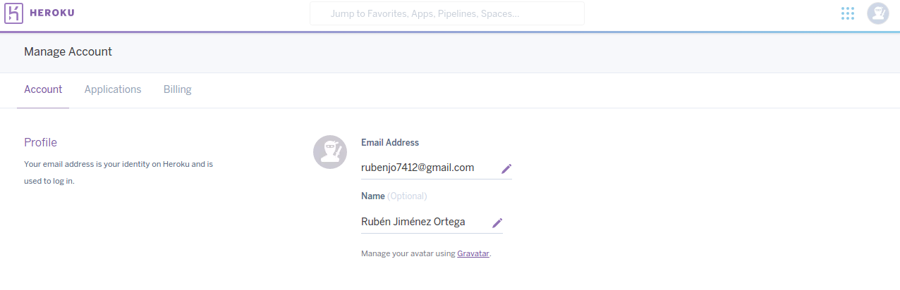
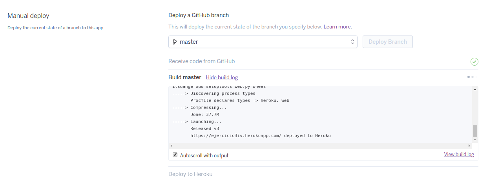

<h1>EJERCICIOS TEMA 2</h1>
<h2>Ruben Jimenez Ortega</h2>

###1. Darse de alta en algún servicio PaaS tal como Heroku, Nodejitsu, BlueMix u OpenShift.

__Heroku__:

1. Rellenar el formulario de registro:

2. Confirmamos el registro mediante un enlace enviado a nuestro correo:

3. Una vez confirmado el correo vemos lo siguiente:

4. Finalmente, podemos acceder a la interfaz de Heroku :

__OpenShitf__:

1. Nos logueamos con nuestra cuenta de Github:

2. Autorizamos la aplicación:

3. Insertamos los datos necesarios:

4. Ya estamos preparados para empezar:

###2. Crear una aplicación en OpenShift o en algún otro PaaS en el que se haya dado uno de alta. Realizar un despliegue de prueba usando alguno de los ejemplos.

1. Creamos la aplicación:

2. Ponemos el nombre que queramos:

3. En la interfaz de OpenShift, buscamos el apartado Instant App y seleccionamos cualquiera, en mi caso yo elegiré la primera opción como prueba:

4. Ponemos los requisitos que nos piden a nuestro gusto:

5. Vemos que ya esta creada nuestra aplicación:

6. Y listo, ya podemos empezar a personalizar la aplicación:

###3. Realizar una app en express (o el lenguaje y marco elegido) que incluya variables como en el caso anterior.

He elegido python y Django. Para poder utilizar variables REST, Django nos da la opción de usar el FrameWork djangorestframework. Para este ejercicio he continuado con el ejemplo de Empresas del tema 2, la nueva aplicación se encuentra alojada en el siguiente [repositorio](https://github.com/rubenjo7/empresas_IV).

Los pasos que he seguido son:

1. Crear entorno de pruebas:

        virtualenv Pruebas
        source Pruebas/bin/activate

2. Instalo las dependencias:

        pip install django
        pip install djangorestframework

3. Creo el proyecto y la aplicación:

        django-admin.py startproject EjerciciosIV
        python manage.py startapp Empresa

4. Añado restFramewokr y aplicación al proyecto en *settings.py*:

        INSTALLED_APPS = (
            'django.contrib.admin',
            'django.contrib.auth',
            'django.contrib.contenttypes',
            'django.contrib.sessions',
            'django.contrib.messages',
            'django.contrib.staticfiles',
            'rest_framework',
            'Empresa',
        )

5. Añado la url de la aplicación a las urls del proyecto:

        urlpatterns = [
            url(r'^admin/', include(admin.site.urls)),
            url(r'^', include('Empresa.urls')),
        ]

6. Creo los modelos con los que voy a trabajar en models.py:

7. Migración y modelado de la base de datos:

        python manage.py makemigrations snippets
        python manage.py migrate

8. Crear clases para las instancias de empresa en formato Json:

9. Creamos el contenido:

10. Creo vistas regulares para Django con la clase:

    10.1. Los primero es crear una subclase HttpResponse que pueda renderizar cualquier dato a formato Json.

    10.2. Después creo las funcionalidades principales de nuestra API que serán, listar empresas o crearlas. Además, también añado funcionalidades para recuperar, actualizar o borrar una empresa.

11. Añado estas vistas, a las rutas de la aplicación. Creo el fichero urls.py y añado lo siguiente:

        from django.conf.urls import url
        from Empresa import views

        urlpatterns = [
            url(r'^Empresa/$', views.Empresa_lista),
            url(r'^Empresa/(?P<pk>[0-9]+)/$', views.Empresa_detalle),
        ]

12. Comprobamos el funcionamiento:

Llegados a este punto, podemos hacer una prueba sobre las vistas, para ello ponemos en marcha el servidor:

    python manage.py runserver

###4. Crear pruebas para las diferentes rutas de la aplicación.

Las rutas que he creado para la aplicación Empresa_mejorada son las indicadas en el ejercicio anterior. Ahora vamos a testear 2 de ellas.

- La primera ruta que vamos a probar es /Empresas/ que devuelve un listado en formato JSON de todas las empresas registradas en la aplicación.
- La siguiente ruta que voy a probar es /Empresa/n que lo que devuelve es la empresa n-esima que haya resgistrada en la aplicación.

###5. Instalar y echar a andar tu primera aplicación en Heroku.

1. Heroku necesita para funcionar es un archivo de configuración llamado Procfile, con el siguiente contenido:

        web: gunicorn EjerciciosIV.wsgi --log-file -

2. Para utilizar heroku de forma remota existe una herramienta llamada heroku toolbet, escogemos la opción de mi sistema operativo (UBUNTU) para realizar la instalación.

3. Subimos el proyecto a heroku. Para poder conectar a heroku a través de su toolbet debemos abrir nuestra terminal y escribir lo siguiente.

        heroku login

      Una vez lo hagamos, nos pedirá nuestras credenciales de heroku, introduzco mi email y password, si todo ha ido bien nos dirá Authentication successful.

4. Una vez dentro, lo siguiente es crear un enlace al repositorio que Heroku nos ofrece para alojar nuestra aplicación:

5. Por último tenemos que hacer push al repositorio de Heroku:

###6. Usar como base la aplicación de ejemplo de heroku y combinarla con la aplicación en node que se ha creado anteriormente. Probarla de forma local con foreman. Al final de cada modificación, los tests tendrán que funcionar correctamente; cuando se pasen los tests, se puede volver a desplegar en heroku.

1. Instalamos foreman:

        pip install foreman

###7. Haz alguna modificación a tu aplicación en node.js para Heroku, sin olvidar añadir los tests para la nueva funcionalidad, y configura el despliegue automático a Heroku usando Snap CI o alguno de los otros servicios, como Codeship, mencionados en StackOverflow

Los test están [aquí](https://github.com/rubenjo7/Empresa_mejorado/blob/master/Empresa/tests.py). Son los que he comentado en ejercicios anteriores.

Para configurar el despliegue automático utilizo Travis CI, diciéndole a Heroku que no despliegue hasta pasar los test:

Una vez guardada la configuración,si todo esta correcto, el pipeline saltará solo de un stage a otro hasta completar el despliegue

###8. Preparar la aplicación con la que se ha venido trabajando hasta este momento para ejecutarse en un PaaS, el que se haya elegido.

Llegados a este punto, la aplicación ya esta lista para su despliegue en Heroku. Este puede llevarse acabo mediante:

    git push heroku master

