<h1>EJERCICIOS TEMA 4</h1>
<h2>Rubén Jiménez Ortega</h2>

###1. Instala LXC en tu versión de Linux favorita. Normalmente la versión en desarrollo, disponible tanto en GitHub como en el sitio web está bastante más avanzada; para evitar problemas sobre todo con las herramientas que vamos a ver más adelante, conviene que te instales la última versión y si es posible una igual o mayor a la 1.0.

La instalación la realizamos con la siguiente orden:

    apt-get install lxc.

Después comprobamos que todo esta correcto:

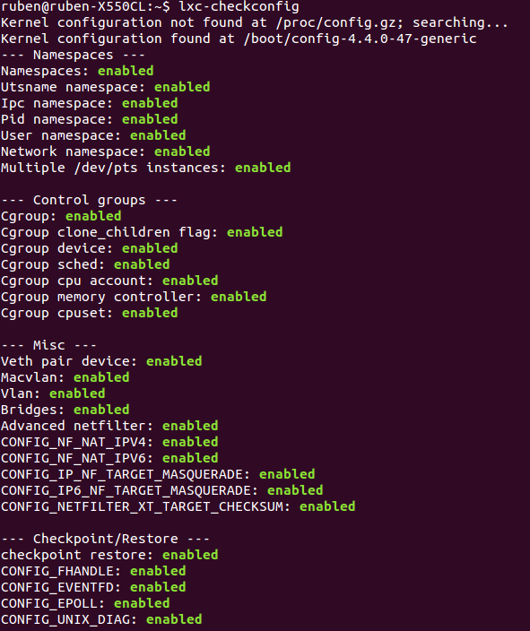

###2. Comprobar qué interfaces puente se han creado y explicarlos.

Creamos un contenedor llamado prueba:

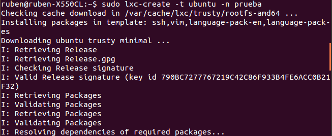

Arrancamos el contenedor y nos conectamos a él, para ello usamos clave y usuario "ubuntu":

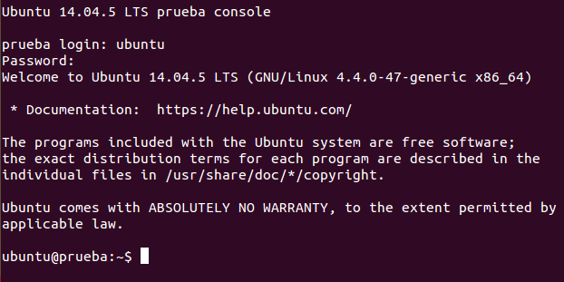

Si hacemos un ifconfig en local podemos ver como se ha creado una nueva interfaz de red, para que el contenedor pueda tener acceso a internet.

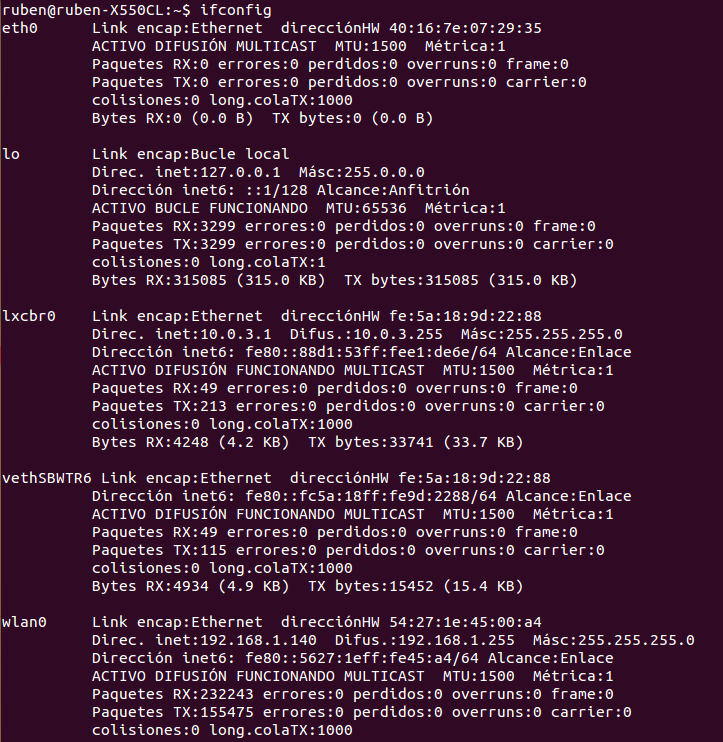

###3. Crear y ejecutar un contenedor basado en Debian. Crear y ejecutar un contenedor basado en otra distribución, tal como Fedora. Nota En general, crear un contenedor basado en tu distribución y otro basado en otra que no sea la tuya. Fedora, al parecer, tiene problemas si estás en Ubuntu 13.04 o superior, así que en tal caso usa cualquier otra distro. Por ejemplo, [Óscar Zafra](https://github.com/IV-GII/GII-2013/issues/87#issuecomment-28639976) ha logrado instalar Gentoo usando un script descargado desde su sitio, como indica en este comentario en el issue.

Creamos el contenedor LXC con la siguiente orden:

    lxc-create -t debian -n debian

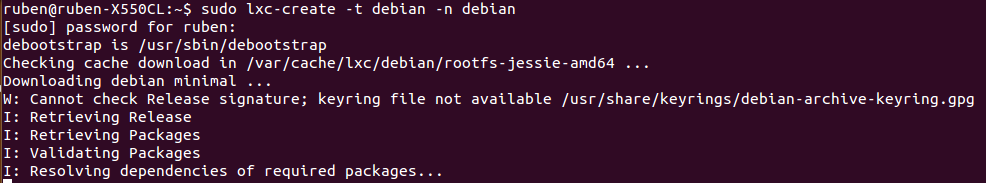

Como mi distribución es Ubuntu 14.04 LTS, creo un contenedor basado en CentOS. CentOS utiliza yum para instalar paquetes por tanto lo instalamos con la orden:

    apt-get install yum

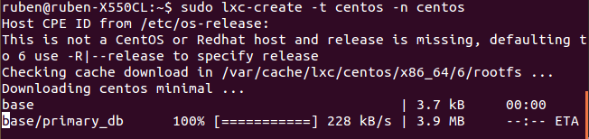

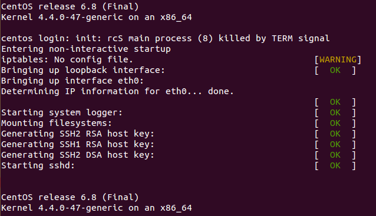

###4. Instalar lxc-webpanel y usarlo para arrancar, parar y visualizar las máquinas virtuales que se tengan instaladas. Desde el panel restringir los recursos que pueden usar: CPU shares, CPUs que se pueden usar (en sistemas multinúcleo) o cantidad de memoria.

Para instalar lxc-webpanel, lo hacemos de la siguiente forma:

    wget http://lxc-webpanel.github.io/tools/install.sh -O - | sudo bash

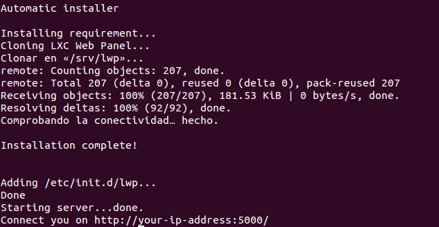

En el navegador ponemos http://localhost:5000/ y nos sale el LXC Web Panel. Hacemos login con el usuario y contraseña "admin".

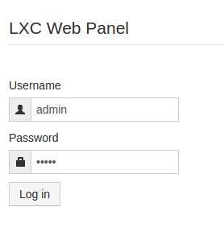

Y ya podemos ver los contenedores que hemos creado:

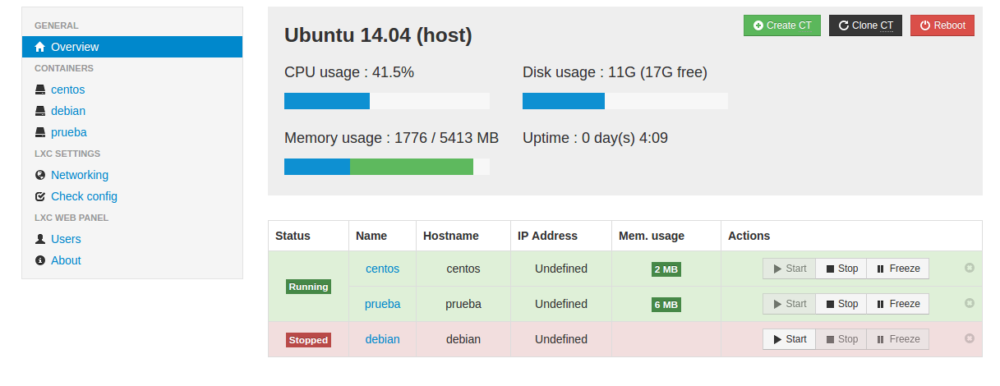

Ahora seleccionamos el contenedor al que queremos restringir los recursos, y lo configuramos a nuestro gusto:

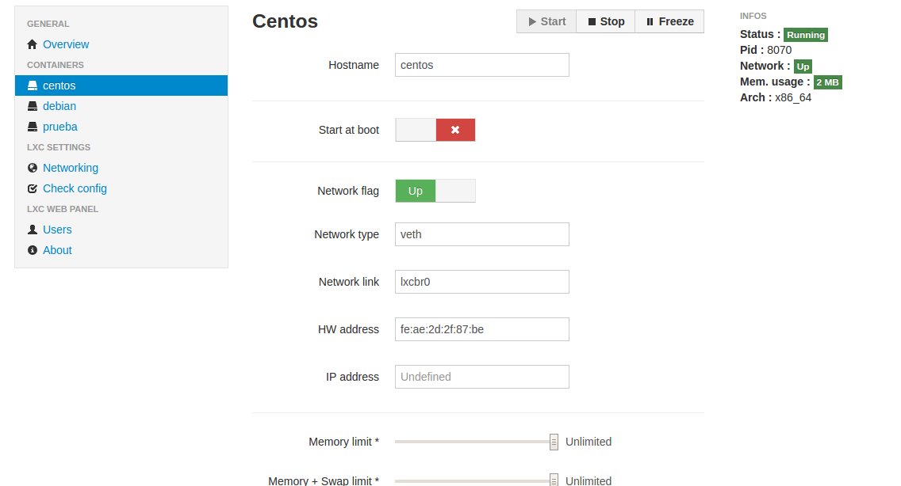

###5. Comparar las prestaciones de un servidor web en una jaula y el mismo servidor en un contenedor. Usar nginx.

Primero instalo nginx:

    sudo apt-get install nginx

###6. Instalar docker.

Para la instalación seguimos el siguiente tutorial.

Instalamos Docker con la siguiente orden:

    apt-get install docker.io

Instalamos transport-https:

    apt-get install apt-transport-https

Añadimos la llave del repositorio Docker:

    apt-key adv --keyserver hkp://keyserver.ubuntu.com:80 --recv-keys 36A1D7869245C8950F966E92D8576A8BA88D21E9

Añadimos el repositorio a nuestra lista apt y actualizmos los repositorios:

    sh -c "echo deb https://get.docker.com/ubuntu docker main\/etc/apt/sources.list.d/docker.list"

Instalamos el paquete lxc-docker y verificamos que se ha instalado:

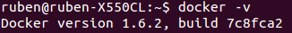

###7. Instalar a partir de docker una imagen alternativa de Ubuntu y alguna adicional, por ejemplo de CentOS. Buscar e instalar una imagen que incluya MongoDB.

Con este comando, descargamos la imagen:

    docker pull imagen

Y para instalarla:

    docker run -i -t imagen.

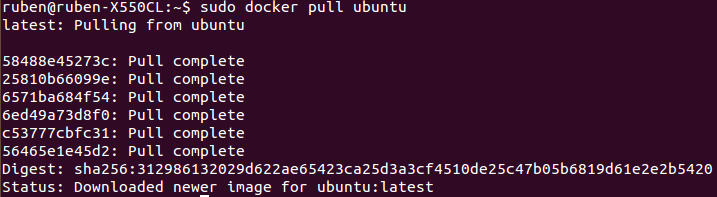

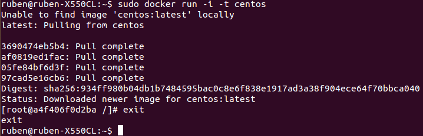

Para ello utilizaré la siguiente orden:

    docker pull hairmare/mongodb

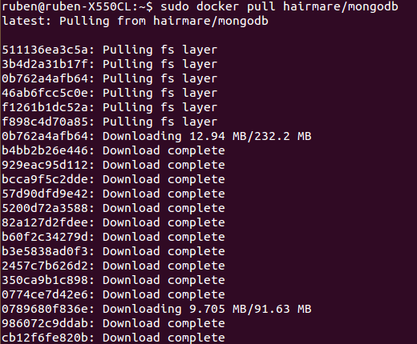

Y finalmente podemos ver las imágenes que tenemos:

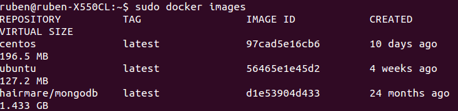

###8. Crear un usuario propio e instalar nginx en el contenedor creado de esta forma.

Para este ejercicio voy a utilizar el contenedor con la imagen de Ubuntu creado en el ejercicio anterior.

Primero, creamos el usuario:

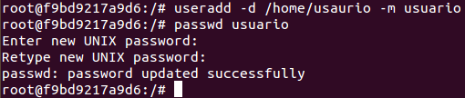

Hacemos login con el usuario creado, e instalamos nginx:

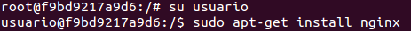

Lo comprobamos:

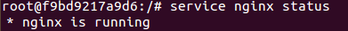

###9. Crear a partir del contenedor anterior una imagen persistente con commit.

Pasos para realizar una imagen persistente:

1. Localizar la ID de la maquina que deseamos commitear:

    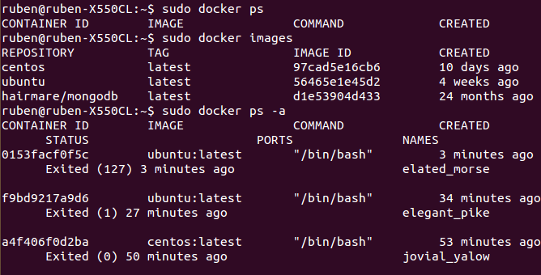

2. Comprobar que la ID es correcta:

        sudo docker inspect ID  

    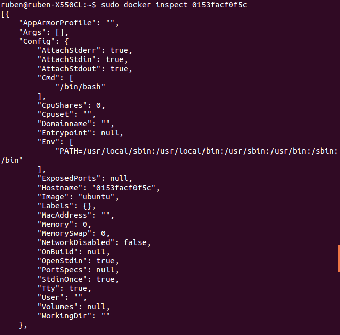

3. Localizar la ID completa de la imagen, buscando en el fichero json resultado de la instrución anterior el campo ID.

4. Realizar el commit:

        sudo docker commit ID nombre_comit

5. Comprobar commit

        sudo docker images

    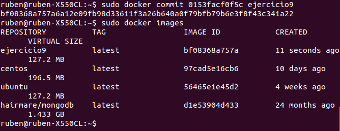

###10. Crear una imagen con las herramientas necesarias para el proyecto de la asignatura sobre un sistema operativo de tu elección.

Se puede ver [aquí](https://github.com/rubenjo7/IV#entorno-de-pruebas).
