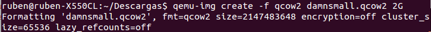
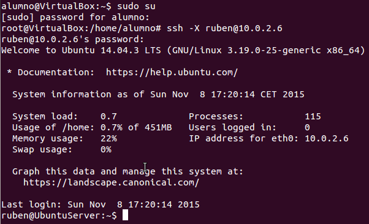

<h1>EJERCICIOS TEMA 5</h1>
<h2>Rubén Jiménez Ortega</h2>

###1. Instalar los paquetes necesarios para usar KVM. Se pueden seguir estas instrucciones. Ya lo hicimos en el primer tema, pero volver a comprobar si nuestro sistema está preparado para ejecutarlo o hay que conformarse con la paravirtualización.

Como ya hicimos en los ejercicios del tema 1  volvemos a comprobar con la orden `kvm-ok`:

###2. Resuelve los siguientes apartados:

####2.1. Crear varias máquinas virtuales con algún sistema operativo libre tal como Linux o BSD. Si se quieren distribuciones que ocupen poco espacio con el objetivo principalmente de hacer pruebas se puede usar CoreOS (que sirve como soporte para Docker) GALPon Minino, hecha en Galicia para el mundo, Damn Small Linux, SliTaz (que cabe en 35 megas) y ttylinux (basado en línea de órdenes solo).

___Slitaz___:

1. Primero creamos el disco duro con la siguiente orden:

    

2. Instalamos la imagen de "slitaz", para ello, es necesario tener una iso del SO que vamos a instalar, después lo lanzamos:

    

___damnsmall___:

1. Primero creamos el disco duro con la siguiente orden:

    

2. Instalamos la imagen de "damnsmall", para ello, es necesario tener una iso del SO que vamos a instalar, después lo lanzamos:

    

####2.2. Hacer un ejercicio equivalente usando otro hipervisor como Xen, VirtualBox o Parallels.

Voy a instalar Slitaz, que ya lo tengo descargado.

1. Abro virtualBox y selecciono NUEVA:

    

2. Seleccionamos la memoria:

    

3. Selecciono el tipo de disco duro:

    

4. Añado al controlador la ISO de Slitaz:

    

5. Arrancamos e instalamos el SO:

    

###3. Crear un benchmark de velocidad de entrada salida y comprobar la diferencia entre usar paravirtualización y arrancar la máquina virtual simplemente con `qemu-system-x86_64 -hda /media/Backup/Isos/discovirtual.img`.

Para este ejercicio he usado el benchmark de [Sysbench](http://www.elmundoenbits.com/2013/04/benchmark-I.html#.WFQVZXXhBpi), los pasos para su instalación y ejecución son los siguientes:

1. Instalación:

          sudo apt-get install sysbench

2. Creación del entorno de trabajo:

          sysbench --test=fileio --file-total-size=5G prepare

      

3. Ejecución de los tests y resultados:

        sysbench --test=fileio --file-total-size=5G \
        --file-test-mode=rndrw --init-rng=on \
        --max-time=300 --max-requests=0 run

    

4. Hecho esto limpiamos el espacio ocupado:

        sysbench --test=fileio --file-total-size=5G cleanup

    

Estos pasos han sido realizados en el ordenador local, a continuación realizaré los mismos pasos para la máquina virtual (Ubuntu Server 16):

###4. Crear una máquina virtual Linux con 512 megas de RAM y entorno gráfico LXDE a la que se pueda acceder mediante VNC y ssh.

He decidido instalar _Lubuntu_.

1. Creamos el almacenamiento:

        qemu-img create -f qcow2 lubuntu.qcow2 4G

2. Creamos la maquina habilitando vnc:

        qemu-system-x86_64 -machine accel=kvm -hda lubuntu.qcow2 -cdrom lubuntu-14.04.5-desktop-amd64.iso -m 512M -boot d -vnc :1

Para conectar por vnc voy a utilizar vinagre. Podemos instalarlo mediante:

    sudo apt-get install vinagre
    vinagre IP_Máquina

**Para conectar por ssh**

Instalamos ssh en la maquina virtual y nos conectamos desde el anfitrión, para ello he usado dos máquinas virtuales, una con ubuntu server y otra con ubuntu.

    sudo apt-get install openssh-server

1. Miramos la Ip que tenemos en ubuntu server:

    

2. Vemos que la IP de Ubuntu Server es 10.0.2.6. Ahora vamos a la segunda máquina:

    

3. Por último, para hacer una prueba, abrimos un archivo gedit, denominado "prueba", desde esta máquina:

    

###5. Crear una máquina virtual ubuntu e instalar en ella alguno de los servicios que estamos usando en el proyecto de la asignatura.

Voy a usar Ubuntu 16 LTS en VirtualBox, por comodidad, ya que lo tengo descargado. He creado algo similar al ejercicio 2.2. He dado de RAM 512MB y de memoria dinámica 8GB.

Por comodidad, una vez instalado voy a descargar mi repositorio de [Github](https://github.com/rubenjo7/IV), para ello tengo que instalar git en la máquina virtual:

    sudo apt-get install git-all

Una vez instalado clonamos el repositorio:

    git clone https://github.com/rubenjo7/IV.git

Ahora instalamos pip y lo actualizamos:

    sudo apt-get install python-pip
    pip install --upgrade pip

Ya esta descargado y pip instalado, ahora tenemos que utilizar el make para instalar todos los servicios necesarios para que el bot funcione, para ello accedemos también al directorio del proyecto:

    cd IV/ && make install

Una vez que tenemos todo lo anterior, añado las variables de entorno y después, ejecutamos con `make ejecutar` y probamos un poco que funciona:

###6. Instalar una máquina virtual con Linux Mint para el hipervisor que tengas instalado.

Primero descargamos la imagen de Linux Mint.

Segundo, creamos el disco duro:

Tercero, instalamos la imagen de Linux Mint:

