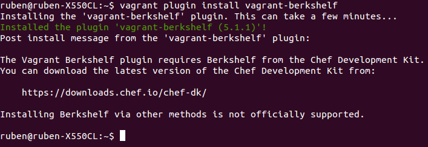

<h1>EJERCICIOS TEMA 6</h1>
<h2>Rubén Jiménez Ortega</h2>

###1. Instalar chef en la máquina virtual que vayamos a usar.

Lo instalo con el siguiente comando:

    curl -L https://www.opscode.com/chef/install.sh | sudo bash

Y compruebo la versión que he instalado:

###2. Crear una receta para instalar la aplicación que se viene creando en la asignatura en alguna máquina virtual o servidor en la nube.

###3. Desplegar la aplicación de DAI con todos los módulos necesarios usando un playbook de Ansible.

###4. Instalar una máquina virtual Debian usando Vagrant y conectar con ella.

1. Instalamos Vagrant:

        sudo apt-get install vagrant

2. Descargamos la imagen de Debian:

        vagrant box add debian https://github.com/holms/vagrant-jessie-box/releases/download/Jessie-v0.1/Debian-jessie-amd64-netboot.box

3. Creamos un fichero Vagrant:

        vagrant init debian

4. Iniciamos la máquina:

        vagrant up

5. Conectamos con la máquina:

        vagrant ssh

###5. Crear un script para provisionar `nginx` o cualquier otro servidor web que pueda ser útil para alguna otra práctica.

He modificado el fichero `vagrantfile` añadiendole lo siguiente:

Aprovisionamos la máquina:

    vagrant provision

Nos conectamos por ssh:

    vagrant ssh

Una vez dentro, comprobamos que funciona ngix:

    sudo service nginx status

###6. Configurar tu máquina virtual usando vagrant con el provisionador chef.

Primero vemos que Chef está disponible en la caja con Vagrant, pero vamos a tener que instalar un plugin para usar Berkshelf:

    vagrant plugin install vagrant-berkshelf

Una vez que la instalación esté completa, tendremos que editar nuestro Vagrantfile. Aquí está mi archivo Vagrant:

    Vagrant.configure("2") do |config|
      config.vm.box = "ubuntu/trusty64"

      config.berkshelf.enabled = true

      config.vm.provision :chef_solo do |chef|
      end
    end

Como se puede ver, he cambiado el cuadro base para usar Ubuntu 14.04 y habilitado el complemento de Berkshelf. También he añadido una sección de aprovisionamiento para configurar el chef-solo.

Entramos en la máquina, y ahora creamos un directorio llamado `cookbooks` y hacemos `cd` dentro de él.

Para crear un cookbook ejecutamos:

    berks cookbook dev

Esto creará un directorio de dev con un cookbook de plantilla dentro.

Para empezar voy a añadir PHP a mi VM. Editamos el archivo `cookbooks/Dev/Berksfile`. Añadimos lo siguiente:

    source "https://supermarket.chef.io"

    metadata
    cookbook 'php', '~> 1.5.0'

Eso es todo lo que necesita hacer la importación de la receta para su uso en su máquina virtual.

El paso final es agregar la receta de PHP a su lista de ejecución de Chef. La lista de ejecución es exactamente como suena, es una lista de recetas para el Chef para ejecutar. A continuación se muestra el Vagrantfile completo y como se puede ver tiene una serie de recetas que incluyen PHP.

    Vagrant.configure(2) do |config|
      config.vm.box = "ubuntu/trusty64"

      config.berkshelf.enabled = true
      config.berkshelf.berksfile_path = "./cookbooks/dev/Berksfile"

      config.vm.provision :chef_solo do |chef|
      chef.run_list = [
        'recipe[php]'
      ]

      end
    end

El paso final es ejecutar `vagrant up` y deberías ver a Chef corriendo en tu VM. Una vez que se ha completado puede hacer `vagrant ssh` y `php -v` para ver que PHP ha sido instalado por el Chef.
